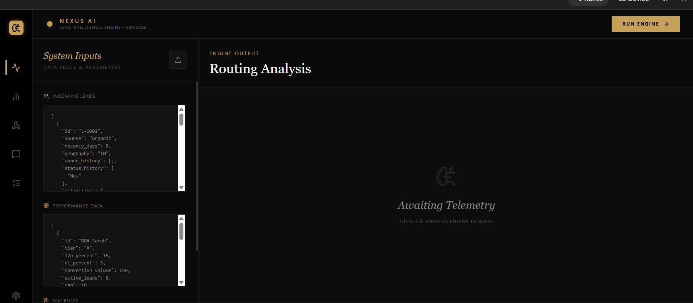
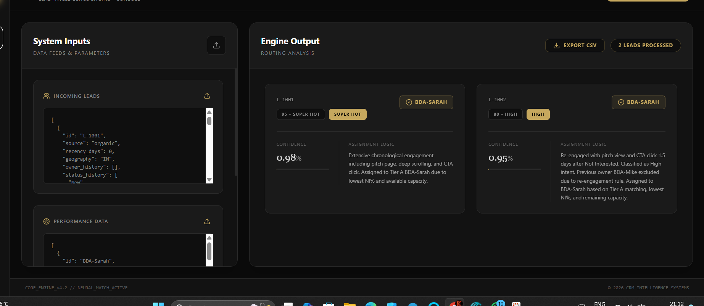
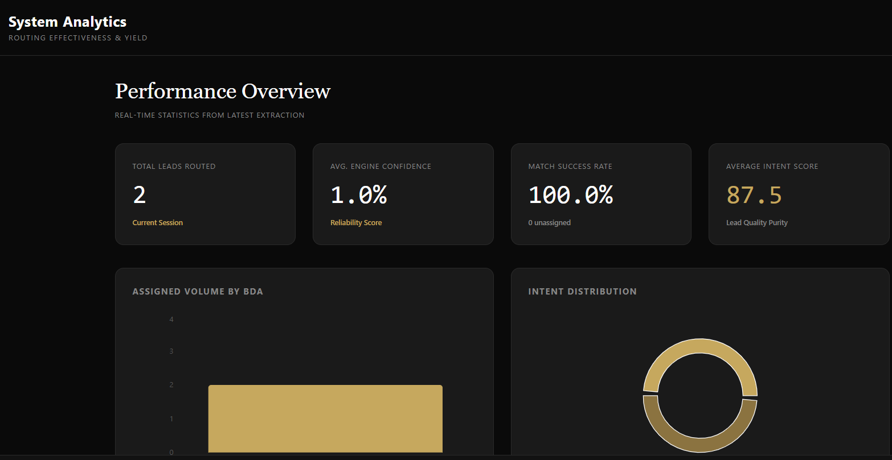

# 🔥 Lead Assignment Recommender (AI-Based)

## 🧠 Problem

In high-volume sales environments, leads come with different levels of intent (e.g., high, medium, low). Manually categorizing and assigning these leads to Business Development Associates (BDAs) based on performance, availability, and SOP rules is time-consuming and often inconsistent.

This leads to:
- Delayed response times
- Inefficient lead distribution
- Missed high-intent opportunities

---

## 🚀 Solution

Built an AI-powered lead assignment system that automatically:
- Categorizes leads based on intent signals
- Evaluates BDA performance and availability
- Assigns the most suitable BDA using predefined SOP logic

---

## ⚙️ How It Works

1. **Data Input**
   - Lead data is fetched from Google Sheets or CRM systems
   - Includes attributes like source, recency, engagement activity, and status history

2. **Intent Classification**
   - Leads are categorized into levels such as *Super Hot*, *High*, etc. based on activity signals

3. **BDA Evaluation**
   - Each BDA is evaluated based on:
     - Current workload (capacity)
     - Historical performance (conversion, NI rate, etc.)
     - Tier mapping

4. **Assignment Logic**
   - System matches leads to BDAs using:
     - SOP rules
     - Intent priority
     - Capacity availability
     - Performance metrics

5. **Explainable Output**
   - Each assignment includes reasoning (why a specific BDA was selected)

---

## 📊 Output

- Assigned BDA for each lead
- Confidence score for assignment
- Detailed explanation of assignment logic
- Performance analytics dashboard

---

## 🛠️ Tools & Platforms Used

- AI Studio / Codex-based development platforms
- Google Sheets (data source integration)
- Automation logic & workflow configuration

---

## 📸 Screenshots

### 🔹 Lead Input

### 🔹 Assignment Output

### 🔹 Dashboard

---

## 🎥 Demo

(Upload your video and paste link here)

---

## 🎯 Impact

- Reduced manual lead assignment effort
- Improved consistency and fairness in distribution
- Faster response to high-intent leads
- Better utilization of BDA capacity
