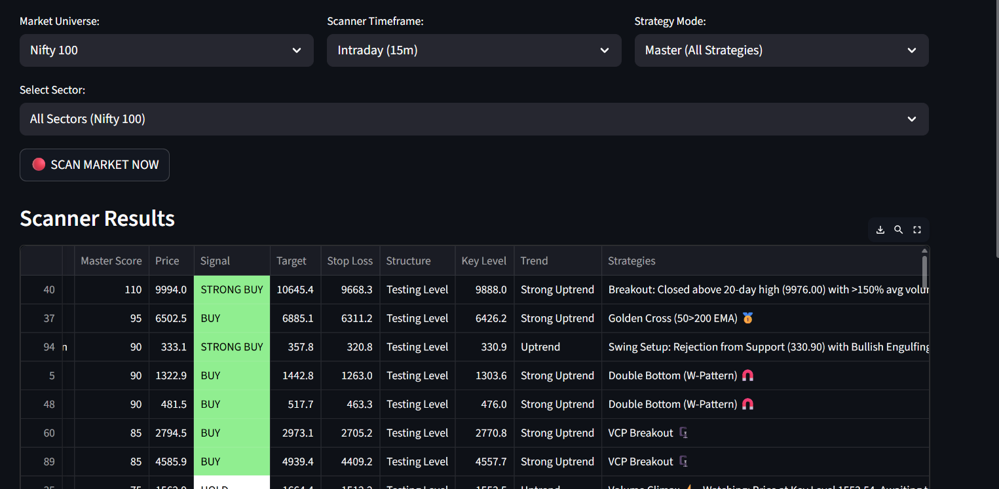
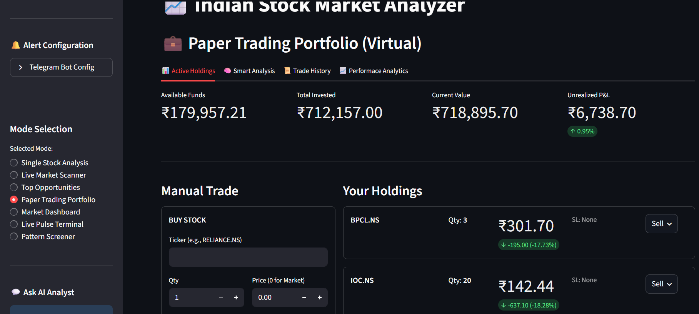

# 📊 Market Pattern Detection & Decision Support Tool

## 🧠 Problem

Retail traders often struggle to identify high-probability trade setups and understand the reasoning behind trade signals. Most tools either provide raw data or signals without clear explanation.

---

## 🚀 Solution

Built a market analysis system that scans stocks for technical patterns and generates trade signals with clear reasoning.

The system focuses not just on identifying opportunities but also explaining **why a trade is suggested**.

---

## ⚙️ How It Works

1. **Market Scanning**
   - Scans selected universe (e.g., Nifty 100 / 500)
   - Filters stocks based on timeframe and strategy

2. **Pattern Detection**
   - Identifies setups such as:
     - Breakouts
     - Golden Cross (50/200 EMA)
     - Support/Resistance reactions
     - Double Bottom / VCP patterns

3. **Signal Generation**
   - Generates signals like:
     - BUY / STRONG BUY
   - Provides:
     - Entry price
     - Target
     - Stop Loss

4. **Explanation Layer (Key Feature)**
   - Each signal includes reasoning such as:
     - Breakout above resistance
     - Volume confirmation
     - Trend alignment
   - Helps users understand decision logic

5. **Paper Trading Module**
   - Simulates trades using virtual capital
   - Tracks performance (P&L, holdings)

---

## 📊 Features

- Live market scanner
- Pattern detection system
- Signal generation with reasoning
- Paper trading portfolio simulation
- Multi-strategy support

---

## 🛠️ Tools & Platforms Used

- AI-assisted development platforms
- Market data integration
- Custom rule-based logic for signal generation

---

## 📸 Screenshots

### 🔹 Pattern Scanner

### 🔹 Paper Trading Portfolio

---

## 🎥 Demo

(Add your video link here)

---

## 🎯 Note

This project is currently in testing phase to evaluate real-world performance and consistency of generated signals.
